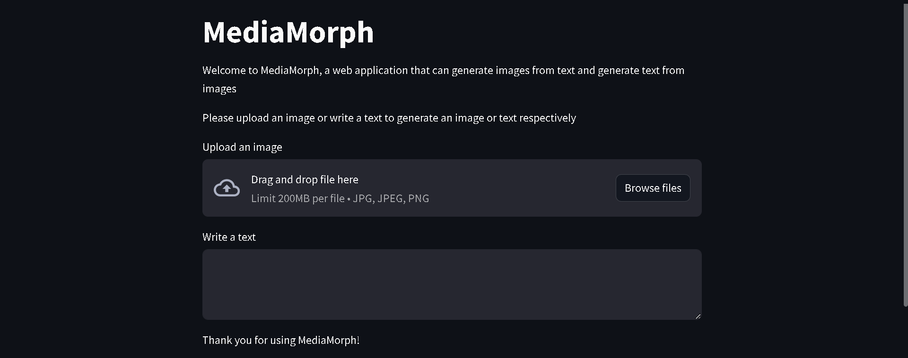

# MediaMorph

MediaMorph is an application that utilizes generative AI to convert text to image or image to text. It provides a user-friendly interface for seamless conversion between these two media types.

## Features

Text to Image Conversion: Convert plain text into visually appealing images.
Image to Text Conversion: Extract text from images using advanced AI algorithms.
Easy-to-Use Interface: Intuitive user interface for a smooth user experience.
Fast and Efficient: Utilizes state-of-the-art AI models for quick and accurate conversions.

## Installation

1. Clone the repository: `git clone https://github.com/your-username/MediaMorph.git`
2. Install the required dependencies: `pip install -r requirements.txt`
3. streamlit run app.py

## Acknowledgements

[OpenAI](https://openai.com/) for their powerful generative AI models.
[Pillow](https://python-pillow.org/) for image processing capabilities.
[Flask](https://flask.palletsprojects.com/) for the web application framework.
Inspired by MandeepKharb 

## Contact

For any inquiries or support, please contact at [preranayekkele@gmail.com]
